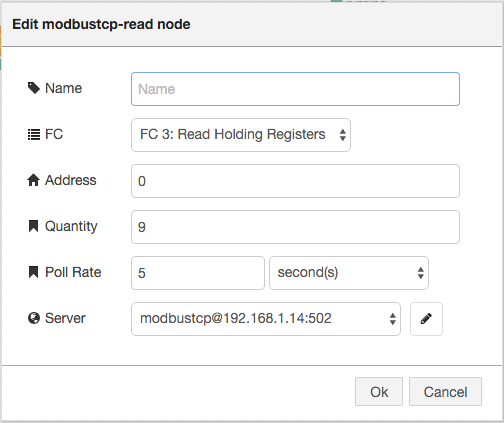
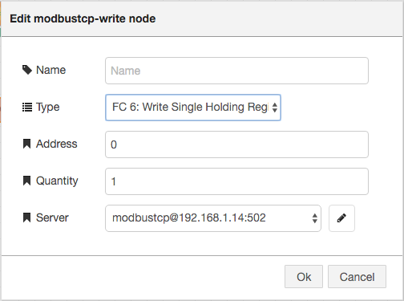

node-red-contrib-modbustcp
========================

[Node-Red][1] Modbus TCP nodes for communicating with a Modbus TCP server.

Based on [jsmodbus][2].

#Install

Run the following command in the root directory of your Node-RED install

    npm install node-red-contrib-modbustcp

#Nodes

#Author

[Jason D. Harper][3] 

[1]:http://nodered.org
[2]:https://www.npmjs.com/package/jsmodbus
[3]:https://github.com/jayharper