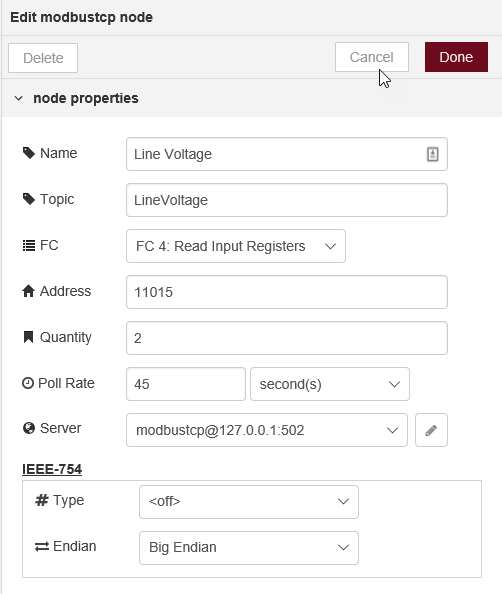

node-red-contrib-modbustcp
========================

[](https://nodei.co/npm/node-red-contrib-modbustcp/)

[Node-Red][1] Modbus TCP nodes for communicating with a Modbus TCP server.

Based on [jsmodbus][2].

# Install

Run the following command in the root directory of your Node-RED install

    npm install node-red-contrib-modbustcp

# Nodes

## modbus read


### API
In addition, you can pass in a msg with one or more payload settings to initiate additional modbus read events. 

```javascript
msg.payload = {
    "name": "Name1", // Should be a unique name
    "topic": "topic1", // Override default topic 
    "dataType": "FC3", // can be format 3, "FC3", or "Coil"
    "address": 0, // starting address
    "quantity": 4, // # of units to read
    "interval": 3000, // polling interval in milliseconds
    "ieeeType": "off", // valid values are "off", "single" or "double"
    "ieeeBE": true // Big Endian format, true/false. false = little endian
}
```

Most of the values are optional and server to override the defaults set in the nodes config. 

Values for dataType inlcude:
* "Coil", "FC1", "FC 1", 1
* "Input", "FC2", "FC 2", 2
* "HoldingRegister", "FC3", "FC 3", 3
* "InputRegister", "FC4", "FC 4", 4

If you pass in a msg with a payload.name that is the same as one previously passed in, the new values will replace the old. For example, it is possible to change the polling interval of an existing event by passing in the same msg structure with a different "interval" setting.

**Note:**  The IEEE 754 formatting is not applied to binary data types such as "Coil" and will be ignored for those.

**Note:** Setting ieeeBE = false will for the node to read the inputs as "little endian".

**Stop/Kill**
You can stop or kill the polling of a modbus item by passing in the following:


The polled event with the same name given will be stopped if the kill=true is also passed in.


#### example single input


#### example multiple input


## modbus write


### API

In addition to passing in a payload value for writing, you can also pass in the following in your msg to override the configured defaults:
* dataType
  * "Coil", "FC5", "FC 5", 5
  * "HoldingRegister", "FC6", "FC 6", 6
  * "Coils", "FC15" "FC 15", 15
  * "HoldingRegisters", "FC16", "FC 16", 16
* address

example message input:
```javascript
msg = {
    address: 8,
    dataType: "Coil",
    payload: 1
}
```
# Author

* [Jason D. Harper][3]
* [Bryan Nystrom][4]


[1]:http://nodered.org
[2]:https://www.npmjs.com/package/jsmodbus
[3]:https://github.com/jayharper
[4]:https://github.com/bnystrom